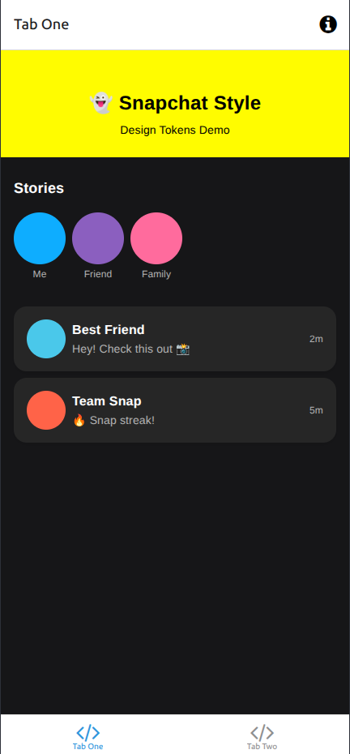
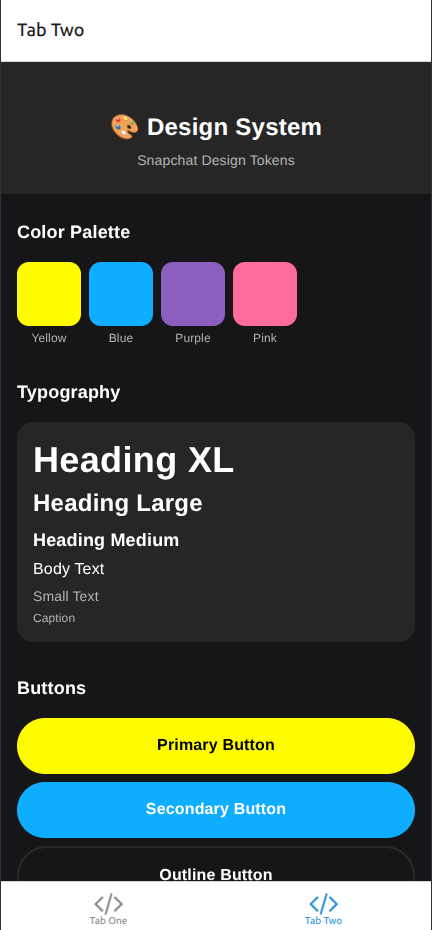

# Expo Tailwind Template

A cross-platform mobile application built with Expo and React Native, featuring a modern UI powered by NativeWind (Tailwind CSS for React Native).

## Features

- Cross-platform support (iOS, Android, Web)
- Modern UI with Tailwind CSS styling via NativeWind
- Tab-based navigation using Expo Router
- TypeScript support
- Responsive design

## Tech Stack

- **Framework**: Expo (~54.0.6)
- **UI Library**: React Native (0.81.4)
- **Navigation**: Expo Router (~6.0.3)
- **Styling**: NativeWind (^4.2.0) + Tailwind CSS (^3.4.17)
- **Language**: TypeScript (~5.9.2)
- **Animations**: React Native Reanimated (~3.17.4)

## Getting Started

### Prerequisites

- Node.js (latest LTS version)
- Expo CLI
- iOS Simulator (for iOS development)
- Android Studio/Emulator (for Android development)

### Installation

1. Clone the repository
```bash
git clone <repository-url>
cd expo-tailwind-template
```

2. Install dependencies
```bash
npm install
```

3. Start the development server
```bash
npm start
```

### Available Scripts

- `npm start` - Start the Expo development server
- `npm run android` - Run on Android device/emulator
- `npm run ios` - Run on iOS device/simulator
- `npm run web` - Run in web browser

## Screenshots

### Main Interface


### Secondary Screen


## Demo

[](./assets/demo/screencast-demo.webm)

*Click to view the demo video*

## Project Structure

```
├── app/                    # App screens and layouts (Expo Router)
│   ├── (tabs)/            # Tab-based screens
│   ├── _layout.tsx        # Root layout
│   └── modal.tsx          # Modal screen
├── assets/                # Static assets (images, fonts)
├── components/            # Reusable React components
├── constants/             # App constants and configurations
└── global.css            # Global styles
```

## License

Private project - All rights reserved.